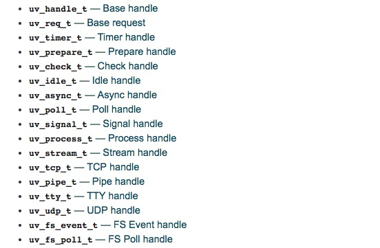
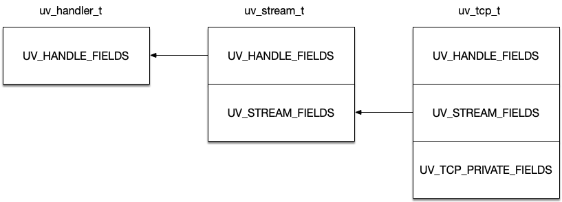
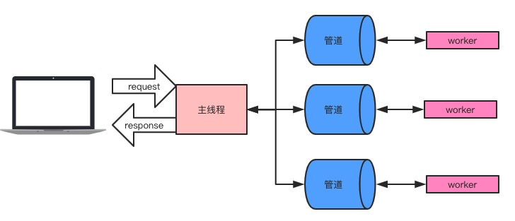
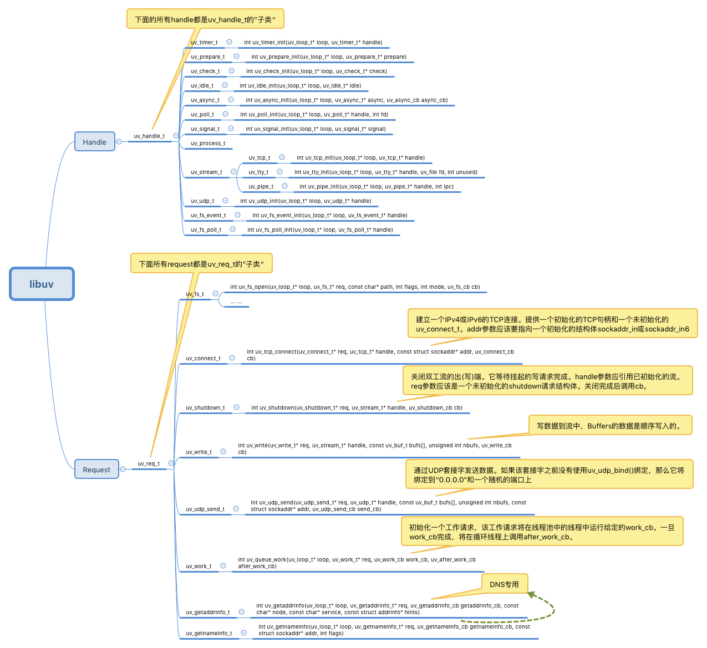

学习完[nodejs基石之一的v8基础篇](https://blog.5udou.cn/blog/-nodejsShen-Ru-Xue-Xi-Xi-Lie-Zhi-libuvJi-Chu-Pian-Yi-96)，我们这次将要继续学习另外一块基石：libuv。关于libuv的设计思想，我已经翻译成中文，还没看过的童鞋还是请跳转到这里： [译文](https://blog.5udou.cn/blog/Yi-Wen-libuvShe-Ji-Si-Xiang-Gai-Shu-87)libuv设计思想概述，如果还没看完这篇文章的童鞋，下面的内容也不建议细看了，因为会有”代沟“的问题~

本文的所有示例代码都可以在这个仓库中找到： [libuv-demo](https://github.com/linxiaowu66/libuv-demo)

## 1、libuv入门介绍
libuv是一个跨平台聚焦于异步IO的库，著名的event-loop便是libuv的一大特色。我们要学习Libuv，那么就要先掌握libuv的编译。

### 1.1、libuv的编译简单介绍
和v8一样，libuv的编译简单概括如下：
```bash
获取libuv源码：
cd ~
mkdir Libuv
cd Libuv
git clone https://github.com/libuv/libuv.git
下载GYP，安装 GYP for macOS：
cd ~/Libuv
git clone https://chromium.googlesource.com/external/gyp.git build/gyp
cd build/gyp
sudo ./setup.py install
在Libuv/libuv目录下指定ninja：./gyp_uv.py -f ninja
导出变量ninja：export PATH=$PATH:/Users/xiaopingguo/repos/my_repos/node_repos/ninja
编译：ninja -C out/Debug
```
### 1.2、libuv简单使用
利用编译好的libuv库文件，我们可以开始写一个简单又经典的例子： Hello world。
```c
#include "stdio.h"
#include "uv.h"

int main() {
  uv_loop_t *loop = uv_default_loop();
  printf("hello libuv");
  uv_run(loop, UV_RUN_DEFAULT);
}
```
喜欢动手的童鞋可以下载一开始提到的demo，其中的`hello_libuv.c`便是，利用如何正确地使用v8嵌入到我们的C++应用中这篇文章讲到的运行方式，我们借助CLion软件和`CMakeLists.txt`文件来编译所有的demo模块，这方面就不再赘述了，记得将`CMakeLists.txt`文件中的`include_directorie`s和`link_directories`改成你在第一小节编译出来的Libuv静态库文件的目录位置。

好了，有了上面的基础之后，我们开始结合demo来入门这个深藏众多秘密的代码库。接下去的文章可能会比较长，一次读不完的话建议收藏起来，多读几次~

## 2、libuv的基础概念介绍与实践
看懂libuv之前，我们需要理解下面这些概念，并用实际用例来测试这些概念。

### 2.1、event-loop线程
我们都知道**线程是操作系统最基本的调度单元，而进程是操作系统的最基本的资源分配单元**，因此可以知道进程其实是不能运行，能运行的是进程中的线程。进程仅仅是一个容器，包含了线程运行中所需要的数据结构等信息。一个进程创建时，操作系统会创建一个线程，这就是主线程，而其他的从线程，都要在主线程的代码来创建，也就是由程序员来创建。因此每一个可执行的运用程序都至少有一个线程

于是libuv一开始便启动了event-loop线程，再在这个主线程上利用线程池去创建更多的线程。在event-loop线程中是一段`while(1)`的死循环代码，直到没有活跃的句柄的时候才会退出，这个时候libuv进程才被销毁掉。清楚这点对于后面的学习至关重要。

### 2.2、Handle
中文翻译为句柄，如[译文](https://blog.5udou.cn/blog/Yi-Wen-libuvShe-Ji-Si-Xiang-Gai-Shu-87)libuv设计思想概述一文所属，整个libuv的实现都是基于`Handle`和`Request`。所以理解句柄以及libuv提供的所有句柄实例才能够真的掌握libuv。按照原文所述，句柄是：

> 表示能够在活动时执行某些操作的长生命周期对象。

理解这句话的意思,首先我们抓住两个关键词：长生命周期、对象。Libuv所有的句柄都需要初始化，而初始化都会调用类似这种函数：`uv_xxx_init`。`xxx`表示句柄的类型，在该函数中，会将传入的形参handle初始化，并赋值返回具体的对象，比如初始化tcp句柄：

```c
... // 随便截取一段初始化代码
handle->tcp.serv.accept_reqs = NULL;
handle->tcp.serv.pending_accepts = NULL;
handle->socket = INVALID_SOCKET;
handle->reqs_pending = 0;
handle->tcp.serv.func_acceptex = NULL;
handle->tcp.conn.func_connectex = NULL;
handle->tcp.serv.processed_accepts = 0;
handle->delayed_error = 0
...
```

理解了句柄其实就是个对象，那么**长生命周期要是怎样的**？

还是以TCP句柄为例子，你在这个例子[tcpserver.c](https://github.com/linxiaowu66/libuv-demo/blob/master/src/tcpserver.c)中，可以看到后面tcp服务器的操作：绑定端口、监听端口都是基于tcp句柄，整个句柄存活于整个应用程序，只要tcp服务器没有挂掉就一直在，因此说是长生命周期的对象。

libuv提供的所有句柄如下：



接下去我们简单介绍以下所有的Libuv的句柄

#### 2.2.1、uv_handle_t

首先libuv有一个基本的handle, `uv_handle_t`，libuv是所有其他handle的基本范式，任何handle都可以强转为该类型，并且和该Handle相关的所有API都可以为其他handle使用。

libuv能否一直运行下去的前提是检查是否有活跃的句柄存在，而检查一个句柄是否活跃,可以使用方法`uv_is_active`，(`const uv_handle_t* handle`检查)，根据句柄类型不同，其含义也不一样：

- `uv_async_t`句柄总是活跃的并且不能停用，除非使用`uv_close`关闭掉
- `uv_pipe_t`、`uv_tcp_t`, `uv_udp_t`等，这些牵扯到`I/O`的句柄一般也都是活跃
- `uv_check_t`, `uv_idle_t`, `uv_timer_t`等，当这些句柄开始`uv_check_start()`, `uv_idle_start()`的时候也是活跃的。

而检查哪些句柄活跃则可以使用这个方法：`uv_print_active_handles(handle->loop, stderr)`;

以[tcpserver.c](https://github.com/linxiaowu66/libuv-demo/blob/master/src/tcpserver.c)为例子，我们启动tcp服务器后，启动一个定时器去打印存在的句柄，结果如下：
```c
void timer_cb(uv_timer_t *handle) {
  uv_print_active_handles(handle->loop, stderr);
  printf("loop is alive[%d], timer handle is active[%d], now[%lld], hrtime[%lld]\n",
      uv_loop_alive(handle->loop), uv_is_active((uv_handle_t *)handle), uv_now(handle->loop), uv_hrtime());
}
```
```bash
loop is alive[1], timer handle is active[1], now[124941901], hrtime[124941901599270]
[-AI] async    0x10f78e9d8
[RA-] tcp      0x10f78e660
[RA-] timer    0x7ffee049d7c0
```

可以看到tcp的例子中一直存活的句柄是`async`、`tcp`、`timer`。它们前面中括号的标志解释如下：

```bash
R 表示该句柄被引用着
A 表示该句柄此时处于活跃状态
I 表示该句柄是内部使用的
```

#### 2.2.2、uv_timer_t
顾名思义，**Libuv的计时器**，用来`在将来某个时候调用对应的回调函数`。其调用时机是在整个轮询的**最最开始**，后面我们会说到轮询的整个步骤。

#### 2.2.3、uv_idle_t

`Idle句柄`在每次循环迭代中运行一次给定的回调，而且**执行顺序是在`prepare句柄`之前**。

与`prepare句柄`的显著区别在于，当存在活动的空闲句柄时，循环将执行零超时轮询，而不是阻塞`I/O`。

在`uv_backend_timeout`方法中我们可以看到返回的轮询I/O超时时间是0：
```c
if (!QUEUE_EMPTY(&loop->idle_handles))
    return 0;
```
idle句柄的回调一般用来执行一些**低优先级**的任务。

>尽管名称叫做“idle”，空闲句柄在每次循环迭代时都会调用它们的回调函数，而不是在循环实际上是“空闲”的时候。

#### 2.2.3、uv_prepare_t

`prepare句柄`将在每次循环迭代中运行一次给定的回调，而且是选择在`I/O轮询之前`。

问题是：**libuv为什么要创造这么一种句柄？**

其实从名称来猜测，libuv应该是想提供一种方式让你可以在轮询I/O之前做些事情，然后在轮询I/O之后使用`check句柄`进行一些结果的校验。

#### 2.2.4、uv_check_t
`check句柄`将在每次循环迭代中运行一次给定的回调，而且是选择在`I/O轮询之后`。其目的在上面已经提过

#### 2.2.5、uv_async_t
`async句柄`允许用户“唤醒”事件循环，并在主线程调用一开始注册的回调。这里说的唤醒其实就是发送消息给`主线程(event-loop线程)`，让其可以执行一开始注册的回调了。

>libuv会对`uv_async_send()`做一个聚合处理。也就是说它并不会调用一次就执行一次回调。

我们使用 [thread.c](https://github.com/linxiaowu66/libuv-demo/blob/master/src/thread.c) 为例子，使用`uv_queue_work`和`uv_async_send`来实践，得到的结果打印如下：

```c
// 打印出主进程ID号和event-loop线程ID
I am the master process, processId => 90714
I am event loop thread => 0x7fff8c2d9380

// 这个是uv_queue_work执行的回调，从线程ID可以看到回调函数是在线程池中的某个线程中执行
I am work callback, calling in some thread in thread pool, pid=>90714
work_cb thread id 0x700001266000

// 这个是uv_queue_work执行完回调后结束的回调，从线程ID:7fff8c2d9380可以看到这个回调已经回到了主线程中执行
I am after work callback, calling from event loop thread, pid=>90714
after_work_cb thread id 0x7fff8c2d9380

// 这个是uv_async_init的回调，其触发是因为在work callback中执行了uv_async_send，可以从0x700001266000得到验证，该回调也是在主线程中执行
I am async callback, calling from event loop thread, pid=>90714
async_cb thread id 0x7fff8c2d9380
I am receiving msg: This msg from another thread: 0x700001266000
```

#### 2.2.6、uv_poll_t

`Poll句柄`用于监视文件描述符的可读性、可写性和断开连接，类似于`poll(2)`的目的。

`Poll句柄`的目的是支持集成外部库，这些库依赖于事件循环来通知套接字状态的更改，比如`c-ares`或`libssh2`。不建议将`uv_poll_t`用于任何其他目的;因为像`uv_tcp_t`、`uv_udp_t`等提供了一个比`uv_poll_t`更快、更可伸缩的实现，尤其是在Windows上。

可能轮询处理偶尔会发出信号，表明文件描述符是可读或可写的，即使它不是。因此，当用户试图从fd读取或写入时，应该总是准备再次处理`EAGAIN`错误或类似的`EAGAIN`错误。

同一个套接字不能有多个活跃的Poll句柄，因为这可能会导致libuv出现busyloop或其他故障。

当活跃的Poll句柄轮询文件描述符时，用户不应关闭该文件描述符。否则可能导致句柄报告错误，但也可能开始轮询另一个套接字。但是，可以在调用`uv_poll_stop()`或`uv_close()`之后立即安全地关闭fd。

>在Windows上，只有套接字的文件描述符可以被轮询，Linux上，任何[`poll(2)`](//linux.die.net/man/2/poll)接受的文件描述符都可以被轮询**

下面罗列的是轮询的事件类型：
```c
enum uv_poll_event {
    UV_READABLE = 1,
    UV_WRITABLE = 2,
    UV_DISCONNECT = 4,
    UV_PRIORITIZED = 8
};
```

#### 2.2.7、uv_signal_t

`Signal句柄`在每个事件循环的基础上实现Unix风格的信号处理。在[udpserver.c](https://github.com/linxiaowu66/libuv-demo/blob/master/src/udpserver.c)中展示了Signal句柄的使用方式：

```c
uv_signal_t signal_handle;
r = uv_signal_init(loop, &signal_handle);
CHECK(r, "uv_signal_init");

r = uv_signal_start(&signal_handle, signal_cb, SIGINT);

void signal_cb(uv_signal_t *handle, int signum) {
  printf("signal_cb: recvd CTRL+C shutting down\n");
  uv_stop(uv_default_loop()); //stops the event loop
}
```

关于Signal句柄有几个点要知悉：

- 以编程方式调用`raise()`或`abort()`触发的信号不会被libuv检测到;所以这些信号不会对应的回调函数。
- `SIGKILL`和`SIGSTOP`是不可能被捕捉到的
- 通过libuv处理`SIGBUS`、`SIGFPE`、`SIGILL`或`SIGSEGV`会导致未定义的行为

#### 2.2.8、uv_process_t

`process句柄`将会新建一个新的进程并且能够允许用户控制该进程并使用流去建立通信通道。对应的demo可以查看：[process.c](https://github.com/linxiaowu66/libuv-demo/blob/master/src/process.c)，值得注意的是，args中提供的结构体的第一个参数path指的是可执行程序的路径，比如在demo中：
```c
const char* exepath = exepath_for_process();
char *args[3] = { (char*) exepath, NULL, NULL };
```
实例中的exepath是：`FsHandl`e的执行路径。

另外一个注意点就是父子进程的std的配置，demo中提供了一些参考，如果使用管道的话还可以参考另外一个demo：[pipe](https://github.com/linxiaowu66/libuv-demo/blob/master/src/pipe)

#### 2.2.9、uv_stream_t

流句柄提供了双工通信通道的抽象。`uv_stream_t`是一种抽象类型，libuv以`uv_tcp_t`、`uv_pipe_t`和`uv_tty_t`的形式提供了3种流实现。这个没有具体实例。但是libuv有好几个方法的入参都是`uv_stream_t`，说明这些方法都是可以被`tcp/pipe/tty`使用，具体有：

```c
int uv_shutdown(uv_shutdown_t* req, uv_stream_t* handle, uv_shutdown_cb cb)
int uv_listen(uv_stream_t* stream, int backlog, uv_connection_cb cb)
int uv_accept(uv_stream_t* server, uv_stream_t* client)
int uv_read_start(uv_stream_t* stream, uv_alloc_cb alloc_cb, uv_read_cb read_cb)
int uv_read_stop(uv_stream_t*)
int uv_write(uv_write_t* req, uv_stream_t* handle, const uv_buf_t bufs[], unsigned int nbufs, uv_write_cb cb)
int uv_write2(uv_write_t* req, uv_stream_t* handle, const uv_buf_t bufs[], unsigned int nbufs, uv_stream_t* send_handle, uv_write_cb cb)
```
#### 2.2.10、uv_tcp_t

tcp句柄可以用来表示TCP流和服务器。上小节说到的`uv_stream_t`是`uv_tcp_t`的”父类“，这里使用结构体继承的方式实现，`uv_handle_t`、`uv_stream_t`、`uv_tcp_t`三者的结构关系如下图：



使用libuv创建tcp服务器的步骤可以归纳为：
```bash
1、初始化uv_tcp_t: uv_tcp_init(loop, &tcp_server)
2、绑定地址：uv_tcp_bind
3、监听连接：uv_listen
4、每当有一个连接进来之后，调用uv_listen的回调，回调里要做如下事情：
  4.1、初始化客户端的tcp句柄：uv_tcp_init()
  4.2、接收该客户端的连接：uv_accept()
  4.3、开始读取客户端请求的数据：uv_read_start()
  4.4、读取结束之后做对应操作，如果需要响应客户端数据，调用uv_write，回写数据即可。
```
更多细节参考[tcpserver](https://github.com/linxiaowu66/libuv-demo/blob/master/src/tcpserver.c)

#### 2.2.11、uv_pipe_t

`Pipe句柄`在Unix上提供了对本地域套接字的抽象，在Windows上提供了命名管道。它是`uv_stream_t`的“子类”。管道的用途很多，可以用来读写文件，还可以用来做线程间的通信。我们在实例中用来实现主线程与多个子线程的互相通信。实现的模型是这样的：



从模型中可以看出，我们利用管道将客户端的连接绑定到随机的一个线程上，之后的操作都是该线程和客户端的通信。

#### 2.2.12、uv_tty_t
TTY句柄表示控制台的一种流，用的比较少，就不多说了~

#### 2.2.13、uv_udp_t
UDP句柄为客户端和服务器封装UDP通信。使用libuv创建udp服务器的步骤可以概括为：

```bash
1、初始化接收端的uv_udp_t: uv_udp_init(loop, &receive_socket_handle)
2、绑定地址：uv_udp_bind
3、开始接收消息：uv_udp_recv_start
4、uv_udp_recv_start里执行回调，可以使用下面方法回写数据发送给客户端
  4.1、uv_udp_init初始化send_socket_handle
  4.2、uv_udp_bind绑定发送者的地址，地址可以从recv获取
  4.3、uv_udp_send发送指定消息
```

如果是官方文档给出的示例的话，那么会使用`uv_udp_set_broadcast`设置广播的地址。具体可以参考[udp](https://docs.libuv.org/en/v1.x/guide/networking.html#udp)

#### 2.2.14、uv_fs_event_t

FS事件句柄允许用户监视一个给定的路径的更新事件，例如，如果文件被重命名或其中有一个通用更改。这个句柄使用每个平台上最佳的解决方案。

### 2.2.15、uv_fs_poll_t
FS轮询句柄允许用户监视给定的更改路径。与`uv_fs_event_t`不同，fs poll句柄使用stat检测文件何时发生了更改，这样它们就可以在不支持fs事件句柄的文件系统上工作。

### 2.3、Request
那么接下去就说到Request这个短生命周期的概念，中文翻译为”请求“，类似于nodejs中的req,它也是一个结构体。还是以上述的tcp服务器为例子，有这么一段代码：

```c
  if (r < 0) {
    // 如果接受连接失败，需要清理一些东西
    uv_shutdown_t *shutdown_req = malloc(sizeof(uv_shutdown_t));

    r = uv_shutdown(shutdown_req, (uv_stream_t *)tcp_client_handle, shutdown_cb);
    CHECK(r, "uv_shutdown");
  }
```

当客户端连接失败，需要关闭掉这个连接，于是我们就会初始化一个request，然后传递给我们需要请求的操作，这里是关闭请求shutdown。

关于libuv提供的句柄和request，我这里整理一张思维导图，可以一看：




libuv的Request操作对比于句柄，还是比较少的。上图把每一个request的使用说明都讲得一清二楚了。我们能做的就是随时翻阅这篇文章即可。

#### 2.3.1、uv_request_t

`uv_request_t`是基本的request，其他任何request都是基于该结构进行扩展，它定义的所有api其他request都可以使用。和`uv_handle_t`一样的功效。

### 2.4、libuv运行的三种模式
接着说说Libuv提供的三种运行模式：

- `UV_RUN_DEFAULT` 默认轮询模式，此模式会一直运行事件循环直到没有活跃句柄、引用句柄、和请求句柄
- `UV_RUN_ONCE` 一次轮询模式，此模式如果`pending_queue`中有回调，则会执行回调而直接跨过`uvio_poll`。如果没有，则此方式只会执行一次I/O轮询（`uvio_poll`）。如果在执行过后有回调压入到了`pending_queue`中，则`uv_run`会返回非0，你需要在未来的某个时间再次触发一次`uv_run`来清空`pending_queue`。

- `UV_RUN_NOWAIT` 一次轮询（无视`pending_queue`）模式，此模式类似`UV_RUN_ONCE`但是不会判断`pending_queue`是否存在回调，直接进行一次I/O轮询。

