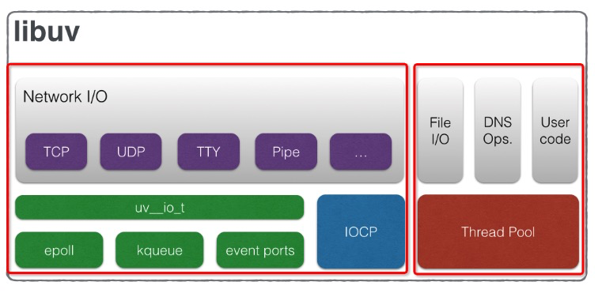
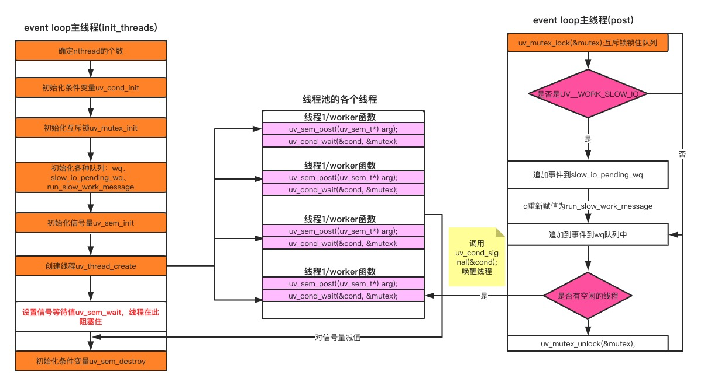

## 3、libuv的事件循环机制
好了，了解了上述的基本概念之后，我们来扯一扯Libuv的事件循环机制，也就是event-loop。还是以[译文]libuv设计思想概述一文展示的两张图片，再结合代码来学习整个Libuv的事件循环机制。

首先回顾一下libuv中有两个抽象概念贯穿整个框架：handle、request。其中handle生命周期较长，且有自己回调方法的一个事务，比如说TCP的handle会处理每一个TCP连接，并触发connection事件。request属于handle中一个生命周期短，且简单的行为，比如向文件进行读、写等等。


### 3.1、解密第一张图片
首先是第一张图片：



细心的童鞋会发现这张图片被我用红框分割成了两部分，为什么呢？**因为Libuv处理fs I/O和网络I/O用了两套机制去实现**，或者说更全面的讲应该是`fs I/O`和 `DNS`等实现的方式和网络 I/O是不一样的。为什么这么说呢？请看下图，你就会明白了：


上图左侧是libuv的两大基石：`event-loop`线程和`thread pool`。而从图的右侧有两条轨迹分别连接到这两个基石，我特别用红色加粗标记，可以看到：

- `Network I/O`最后的调用都会归结到`uv__io_start`这个函数，而该函数会将需要执行的`I/O事件和回调`塞到watcher队列中，之后`uv_run`函数执行的**Poll for I/O阶段**做的便是从watcher队列中取出事件调用系统的接口，这是其中一条主线

- `Fs I/O`和`DNS`的所有操作都会归结到调用`uv__work_sumit`这个函数，而该函数就是执行线程池初始化并调度的终极函数。这是另外一条主线。

### 3.2、解密第二张图片

接着我们来看第二张图片，我们依然将该图片进行改造如下：


整个事件循环的执行主体是在`uv_run`中，每一次的循环经历的阶段对应的函数在上图中已经标注出来，理论上轮询都是一个无尽循环，所以不用在意loop alive问题。有几个重点要说一下：

循环是否退出(也就是进程是否结束)取决于以下几个条件中的一个：
```bash
1.1、loop->stop_flag变为1并且uv__loop_alive返回不为0，也就是调用uv_stop函数并且loop
不存在活跃的和被引用的句柄、活跃的请求或正在关闭的句柄。

1.2、事件循环运行模式等于UV_RUN_ONCE或者是UV_RUN_NOWAIT
```
I/O循环的超时时间的确定：
```bash
2.1、如果时间循环运行模式是UV_RUN_NOWAIT，超时为0。

2.2、如果循环将要停止(代码调用了uv_stop())，超时为0。

2.3、如果没有活跃句柄或请求，超时为0。

2.4、如果有任何Idle句柄处于活跃状态，超时为0。

2.5、如果有等待关闭的句柄，超时为0。

2.6、如果以上情况都不匹配，则采用最近的计时器的超时时间-当前时间(handle->timeout-loop->time)，
或者如果没有活动计时器，则为无穷大(即返回-1)。
```
事件轮询方法源码精炼如下:
```c
int uv_run(uv_loop_t *loop, uv_run_mode mode) {
  // ...

  while (r != 0 && loop->stop_flag == 0) {
    // update loop time
    uv_update_time(loop);
    // run due timers
    uv__run_timers(loop);
    // call pending callbacks
    ran_pending = uv_process_reqs(loop);
    // run idle handles
    uv_idle_invoke(loop);
    // run prepare handles
    uv_prepare_invoke(loop);
    // poll的阻塞时间处理
    timeout = 0;
    if ((mode == UV_RUN_ONCE && !ran_pending) || mode == UV_RUN_DEFAULT)
      timeout = uv_backend_timeout(loop);
    // poll for I/O
    if (pGetQueuedCompletionStatusEx)
      uv__poll(loop, timeout);
    else
      uv__poll_wine(loop, timeout);

    // run check handles
    uv_check_invoke(loop);
    // call close callbacks
    uv_process_endgames(loop);
  }
  // ...
  return r;
}

```
I/O循环的实现主体`uv__io_poll`根据系统不同，使用方式不一样，如果对linux系统熟悉的话，epoll方式应该也会了解。更多epoll的只是可以参考该文章：Linux IO模式及 select、poll、epoll详解

**Run idle hanldes、Run prepare handles、Run check handles**这三个虽然名字不一样，但是主要作用类似，只是在调用顺序上有所不同。由于`Poll for I/O`是一个比较特殊的操作，所以这里提供prepare、check两个钩子函数可以在这个事务前后进行一些别的调用，大可以用vue的钩子函数created、mounted来帮助理解。　　

idle除去调用较早，也影响poll for I/O这个操作的阻塞时间timeout，官网原文: If there are any idle handles active, the timeout is 0.正常情况下事件轮询会根据情况计算一个阻塞时间timout来决定poll for I/O操作的时间。　　

这里用一个C++例子来证明调用顺序，忽略上面的宏，直接看main函数，特别简单！！！

```c
#include <iostream>
#include "uv.h"
using namespace std;

void idle_callback(uv_idle_t* idle);
void prepare_callback(uv_prepare_t* prepare);
void check_callback(uv_check_t* check);

#define RUN_HANDLE(type) \
do {    \
uv_##type##_t type;    \
uv_##type##_init(loop, &type);    \
uv_##type##_start(&type, type##_callback);    \
} while(0)

#define CALLBACK(type)  \
do {    \
cout << "Run " << #type << " handles" << endl;   \
uv_##type##_stop(type);    \
} while(0)

#define OPEN(PATH, callback) \
do {    \
uv_fs_t req;    \
uv_fs_open(loop, &req, PATH, O_RDONLY, 0, callback); \
uv_fs_req_cleanup(&req);    \
} while(0)

void idle_callback(uv_idle_t* idle) { CALLBACK(idle); }
void prepare_callback(uv_prepare_t* prepare) { CALLBACK(prepare); }
void check_callback(uv_check_t* check) { CALLBACK(check); }
void on_open(uv_fs_t* req) { cout << "poll for I/O" << endl; }

int main(int argc, const char * argv[]) {
    auto loop = uv_default_loop();
    
    RUN_HANDLE(check);
    RUN_HANDLE(prepare);
    RUN_HANDLE(idle);
    
    OPEN("/Users/feilongpang/workspace/i.js", on_open);
    
    uv_run(loop, UV_RUN_DEFAULT);
    uv_loop_close(loop);
    return 0;
}
```
执行的时候还发现了一个问题，如果不提供一个I/O操作，Run check handles那一步是会直接跳过，所以手动加了一个open操作。　　可以看到，我特意调整了callback的添加顺序，但是输出依然是:
```bash
Run idle handles
Run prepare handles
poll for I/O
Run check handles
```
所以，代码确实是按照官网示例所给的图顺序来执行。


## 4、libuv的线程池

说完时间循环的主线程，接下去我们继续揭秘libuv的线程池。

libuv提供了一个`threadpool`，可用来运行用户代码并在事件循环线程(event-loop)中得到通知。这个线程池在内部用于运行所有文件系统操作，以及`getaddrinfo`和`getnameinfo`请求。当然如果你想要将自己的代码放在线程池中运行也是可以的，libuv提供除了`uv_queue_work`的方法供开发者自己选择。

它的默认大小为4，但是可以在启动时通过将`UV_THREADPOOL_SIZE`环境变量设置为任意值(最大值为1024)来更改它。

threadpool是全局的，并在所有事件循环中共享。当一个特定的函数使用`threadpool`(即当使用`uv_queue_work()`)时，libuv预先分配并初始化`UV_THREADPOOL_SIZE`所允许的最大线程数。这导致了相对较小的内存开销(128个线程大约1MB)，但在运行时提高了线程的性能。

关于线程的操作，demo中的文件是：[传送门](https://github.com/linxiaowu66/libuv-demo/blob/master/src/thread.c)

在实例中，我们用了三种方式来实现和线程相关的一些操作：

- 从线程池中调度一个线程运行回调: `uv_queue_work`
- 使用`uv_async_send`来“唤醒” `event loop`主线程并执行`uv_async_init`当初设置好的回调
- 使用`uv_thread_create`手动创建一个线程来执行

我们在上一节中知道，想要创建线程池并让他们工作，唯一绕不开的函数是uv__work_submit，大家可以在libuv源码中搜寻这个，可以发现能够找到的也就这几个文件：(以unix系统为例)

```bash
threadpool.c
  1. uv__work_submit实现地方
  2. uv_queue_work调用
fs.c
  1. 宏定义POST调用，所有的fs操作都会调用POST这个宏
getaddrinfo.c
  1. uv_getaddrinfo调用
getnameinfo.c
  1. uv_getnameinfo调用
```

细心的童鞋发现，每一处调用的地方都会传一个叫做enum uv__work_kind kind的操作，根据上面的调用，可以看出分为了3种任务类型：

- `UV__WORK_CPU`：CPU 密集型，UV_WORK 类型的请求被定义为这种类型。因此根据这个分类，不推荐在 uv_queue_work 中做 I/O 密集的操作。
- `UV__WORK_FAST_IO`：快 IO 型，UV_FS 类型的请求被定义为这种类型。
- `UV__WORK_SLOW_IO`：慢 IO 型，UV_GETADDRINFO 和 UV_GETNAMEINFO 类型的请求被定义为这种类型

### 4.2、线程池的初始化

学习线程池初始化之前，我们先得普及一下线程间的同步原语。这样后面看的代码才不会糊里糊涂

libuv提供了mutex锁、读写锁、信号量(Semaphores)、条件量(Conditions)、屏障(Barriers)五种手段来实现线程间资源竞争互斥同步等操作。接下去会简单地介绍，以便待会的初始化流程可以读懂。

#### 4.2.1、Mutex锁
互斥锁用于对资源的互斥访问，当你访问的内存资源可能被别的线程访问到，这个时候你就可以考虑使用互斥锁，在访问的时候锁住。对应的使用流程可能是这样的：

```bash
初始化互斥锁：uv_mutex_init(uv_mutex_t* handle)
锁住互斥资源：uv_mutex_lock(uv_mutex_t* handle)
解锁互斥资源：uv_mutex_unlock(uv_mutex_t* handle)
```

在线程初始化的过程中，我们会初始化一个全局的互斥锁：
```c
static void init_threads(void) {
  ...
  if (uv_mutex_init(&mutex))
    abort()
  ...
}
```

而后在每个线程的执行实体worker函数中，就使用互斥锁对下面几个公共资源进行锁住与解锁：

- 请求队列 wq：线程池收到 `UVWORK_CPU` 和 `UVWORK_FAST_IO` 类型的请求后将其插到此队列的尾部，并通过 `uv_cond_signal` 唤醒 worker 线程去处理，这是线程池请求的主队列。
- 慢 I/O 队列 `slow_io_pending_wq`：线程池收到 `UV__WORK_SLOW_IO` 类型的请求后将其插到此队列的尾部。
- 慢 I/O 标志位节点 `run_slow_work_message`：当存在慢 I/O 请求时，用来作为一个标志位放在请求队列 wq 中，表示当前有慢 I/O 请求，worker 线程处理请求时需要关注慢 I/O 队列的请求；当慢 I/O 队列的请求都处理完毕后这个标志位将从请求队列 wq 中移除。

```c
static void worker(void* arg) {
  ...
  uv_mutex_lock(&mutex);

  ...
  uv_mutex_unlock(&mutex);
}
```

#### 4.2.2、读写锁
读写锁没有用在线程的启动过程中，我们在demo中用来实践对某个全局变量的访问。具体使用步骤参考代码，这里就不再赘述。

###3 4.2.3、信号量

信号量是一种专门用于提供不同进程间或线程间同步手段的原语。信号量本质上是一个非负整数计数器，代表共享资源的数目，通常是用来控制对共享资源的访问。一般使用步骤是这样的：

```bash
初始化信号量：int uv_sem_init(uv_sem_t* sem, unsigned int value)
信号量加1：void uv_sem_wait(uv_sem_t* sem)
信号量减1：void uv_sem_post(uv_sem_t* sem)
信号量销毁：void uv_sem_wait(uv_sem_t* sem)
```
在线程池初始化过程中，我们利用信号量来等待所有的线程初始化结束，如下代码：

```c
static void init_threads(void) {
  ...
  for (i = 0; i < nthreads; i++)
    uv_sem_wait(&sem);

  uv_sem_destroy(&sem);
}

// 而每个线程的执行实体都会去将信号量-1：
static void worker(void* arg) {
  struct uv__work* w;
  QUEUE* q;
  int is_slow_work;

  uv_sem_post((uv_sem_t*) arg);
  ...
}
```

这样只要所有的线程没有初始化完成，`uv_sem_destroy`这个函数是不会执行到的，整个初始化函数也不会返回，此时的主线程也就阻塞在这里了。

#### 4.2.4、条件变量

而条件变量通过允许线程阻塞和等待另一个线程发送信号的方法弥补了互斥锁的不足。条件变量的内部实质上是一个等待队列，放置等待（阻塞）的线程，线程在条件变量上等待和通知，互斥锁用来保护等待队列（因为所有的线程都可以放入等待队列，所以等待队列成为了一个共享的资源，需要被上锁保护），因此条件变量通常和互斥锁一起使用。一般使用步骤是这样的：

```bash
初始化条件变量：int uv_cond_init(uv_cond_t* cond)
线程阻塞等待被唤醒：void uv_cond_wait(uv_cond_t cond, uv_mutex_t mutex)
别的线程唤醒阻塞的线程：void uv_cond_signal(uv_cond_t* cond)
```

libuv使用条件变量来阻塞线程池和唤醒线程池，使用代码如下：

```c
static void init_threads(void) {
  if (uv_cond_init(&cond))
    abort();
}

static void worker(void* arg) {
  ...
  for (;;) {
    /* `mutex` should always be locked at this point. */

    /* Keep waiting while either no work is present or only slow I/O
       and we're at the threshold for that. */
    while (QUEUE_EMPTY(&wq) ||
           (QUEUE_HEAD(&wq) == &run_slow_work_message &&
            QUEUE_NEXT(&run_slow_work_message) == &wq &&
            slow_io_work_running >= slow_work_thread_threshold())) {
      idle_threads += 1;
      uv_cond_wait(&cond, &mutex);
      idle_threads -= 1;
    }
    ...
  }
}
static void post(QUEUE* q, enum uv__work_kind kind) {
  ...
  if (idle_threads > 0)
    uv_cond_signal(&cond)
  ...
}
```

从上面三处代码可以看到线程启动之后就进入阻塞状态，直到有I/O请求调用`uv_cond_signal`来唤醒，按照`uv_cond_wait`调用的顺序形成一个等待队列，循环调用。

#### 4.2.5、屏障

在多线程的时候，我们总会碰到一个需求，就是需要等待一组进程全部执行完毕后再执行某些事，由于多线程是乱序的，无法预估线程都执行到哪里了，这就要求我们有一个屏障作为同步点，在所有有屏障的地方都会阻塞等待，直到所有的线程都的代码都执行到同步点，再继续执行后续代码。使用步骤一般是：

```bash
初始化屏障需要达到的个数：int uv_barrier_init(uv_barrier_t* barrier, unsigned int count)
每当达到条件便将计数+1：int uv_barrier_wait(uv_barrier_t* barrier)
销毁屏障：void uv_barrier_destroy(uv_barrier_t* barrier)
```

只有当初始化计数的值为0，主线程才会继续执行，具体使用方法可以参考demo。

至此借助于线程间同步原语，我们就哗啦啦地把线程的初始化以及大概的工作机制讲完了，总结出了下面一张图：



### 4.3、线程池工作调度

线程池的工作利用的是主线程post函数和各个线程的worker函数，post函数的工作内容如下：

```bash
- 判断请求的请求类型是否是 `UV__WORK_SLOW_IO`：
  - 如果是，将这个请求插到`慢 I/O `请求队列 `slow_io_pending_wq` 的尾部，
     同时在请求队列 wq 的尾部插入一个 `run_slow_work_messag`e 节点作为标志位，
     告知请求队列 `wq` 当前存在慢 I/O 请求。
  - 如果不是，将请求插到请求队列 wq 尾部。
- 如果有空闲的线程，唤醒某一个去执行请求。
```
并发的慢 I/O 的请求数量不会超过线程池大小的一半，这样做的好处是避免多个慢 I/O 的请求在某段时间内把所有线程都占满，导致其它能够快速执行的请求需要排队。

```c
static unsigned int slow_work_thread_threshold(void) {
  return (nthreads + 1) / 2;
}
```
而各个线程的工作内容如下：

- 等待唤醒。
- 取出请求队列 `wq` 或者`慢 I/O` 请求队列的头部请求去执行。 `=> w->work(w)`;
- 通知 `uv loop` 线程完成了一个请求的处理。=> `uv_async_send`
- 回到最开始循环的位置。

### 4.4、线程间的通信
上一小节清晰地描述了libuv的主线程是如何将请求分给各个线程以及线程是如何处理请求的，那么上述过程中还有一个步骤：线程池里面的线程完成工作之后是如何通知主线程的？主线程收到通知之后又继续做了些什么？

这个过程我们称之为线程间的通信。上一小节中或者我们的demo中已经知道，完成这个事情的主要函数是uv_async_send，那么这个函数是如何实现的呢？请看下图：


从图中我们可以看到，借助于io poll与管道，线程池的线程写入数据，被主线程轮询出来，知道有消息过来，就开始执行对应的回调函数。整个流程就是这么easy~

### 参考
[Linux IO模式及 select、poll、epoll详解](https://segmentfault.com/a/1190000003063859)
[Node.js 异步：文件 I/O](https://zhuanlan.zhihu.com/p/64953289)