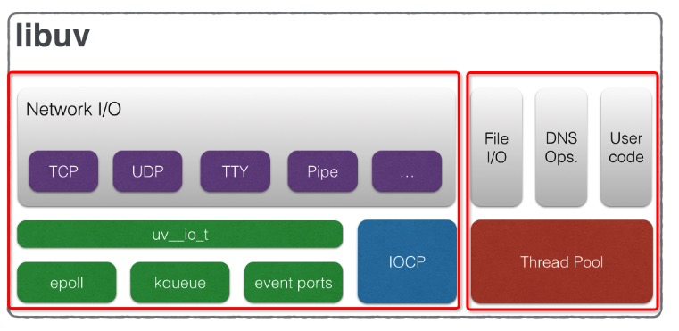
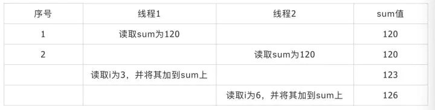
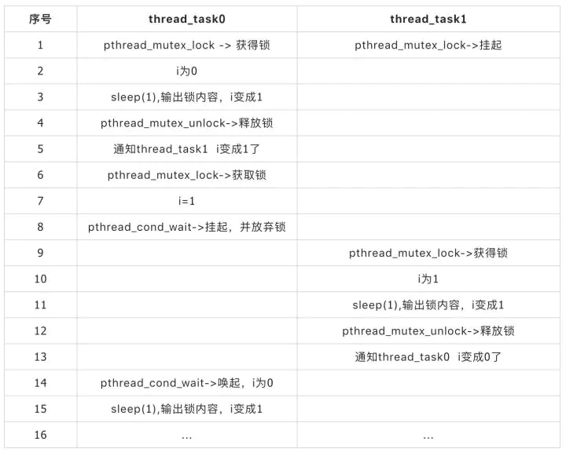
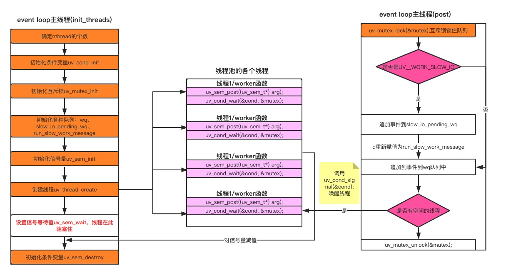
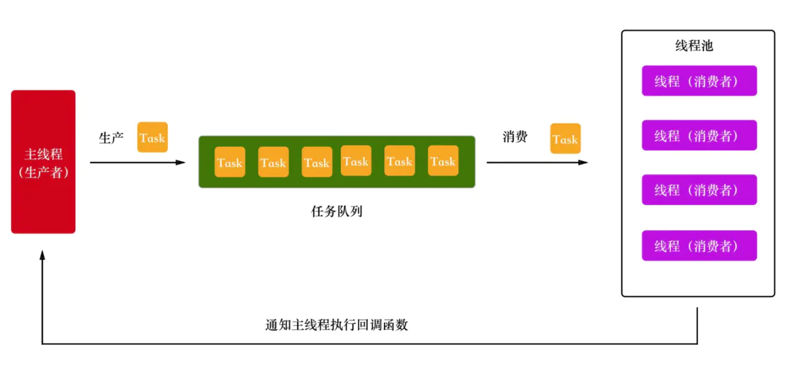
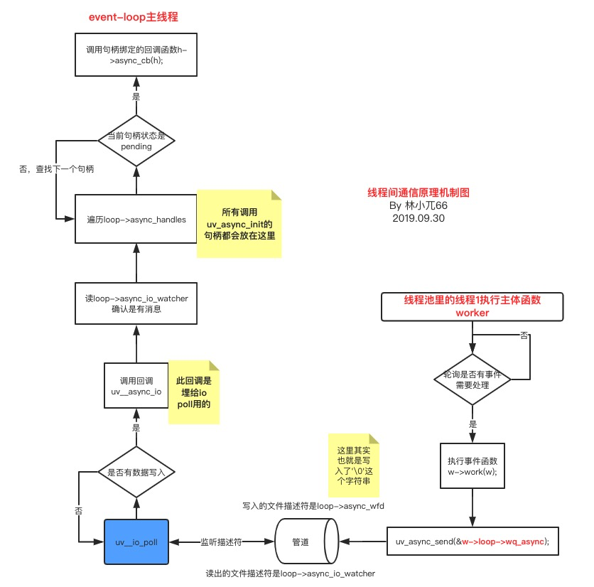

不像网络IO，libuv没有特定平台的异步IO原语可以依赖，所以当前是在线程池中执行阻塞（同步）IO来实现异步的。

根据libuv官网对其架构的介绍，我们可以知道它并不是单线程的，它有一个线程池，用来处理`文件IO`、`DSN查询`等操作。在介绍线程池之前，先通过POSIX Threads介绍一下线程的基本操作，如果您对libuv的整体架构感兴趣，可以访问下面[链接](http://docs.libuv.org/en/v1.x/design.html)了解，当然以后我也会写文章介绍的。



## Linux Threads

相信大家对线程的概念都有或多或少的了解，这里就不介绍了，下面将直接通过API和demo来学习。由于不同平台线程的规范和原语不一样，而我对Linux比较熟悉，所以接下来将通过Linux中的POSIX Threads来讲解。libuv线程池主要涉及到**线程创建、互斥锁和条件变量**3个东西，下面将分别介绍它们。线程创建让我们首先了解一下如何创建线程，

代码和输出如下：
```c
#include <stdio.h>
#include <pthread.h> // 线程相关的api

#define NUM_THREADS 5 //线程数

int sum = 0;

// 线程执行,将输入的int参数作为max，将0，1，2，3，...，max依次加到sum上
void * thread_task(void * args) {
    int max = (int)args;

    for (int i = 0; i <= max; ++i) {
        sum += i;
    }
    printf("sum: %i\n", sum);
    pthread_exit(NULL); // pthread_exist结束线程
}

int main() {
    pthread_t threads[NUM_THREADS]; // 定义了5个代表线程的数组threads

    pthread_attr_t attr; // 定义线程属性变量attr
    pthread_attr_init(&attr);
    pthread_attr_setstacksize(&attr, 8192); // 将线程的栈设为8192个字节

    for (int i = 0; i < NUM_THREADS; ++i) {
        pthread_t thread = threads[i];  // 创建线程
        // 每个线程将会执行thread_task函数，并通过第3个参数将10传递给thread_task
        int result = pthread_create(&thread, &attr, thread_task, (void *)10);
        if (result) {
            printf("线程创建失败 errCode：%i", result);
            return -1;
        }
    }
    pthread_attr_destroy(&attr);

    for (int i = 0; i < NUM_THREADS; ++i) {
        pthread_t thread = threads[i];
        int result = pthread_join(thread, NULL); // 通过pthread_join告诉main函数等到所有线程执行完之后再继续执行
        if (result == 3) {
            printf("线程%i已经结束了\n", i);
            continue;
        }
    }

    printf("main函数运行结束, sum: %i\n", sum);
    return 0;
}
```

上面代码很简单，创建5个线程，每个线程将传入数据作为最大值max，然后从0，1，2，3，...，max加到sum上。

接下来定义了一个函数`thread_task`，该函数会被每个线程执行。函数很简单，将输入的int参数作为max，将0，1，2，3，...，max依次加到sum上，并将当前sum输出到控制台。最后执行`pthread_exist`结束线程。

最后让我们看下main函数里面的内容，先定义了5个代表线程的数组threads；接着定义线程属性变量attr，将线程的栈设为8192个字节；之后通过pthread_create创建线程，每个线程将会执行thread_task函数，并通过第3个参数将10传递给thread_task；最后通过pthread_join告诉main函数等到所有线程执行完之后再继续执行。


### 互斥锁

如果足够仔细，相信你可能已经发现上面的输出不符合预期，按理说应该输出275才对，为啥只输出了249呢？
```bash
sum: 57
sum: 84
sum: 139
sum: 194
sum: 249
线程0已经结束了
线程1已经结束了
线程2已经结束了
线程3已经结束了
线程4已经结束了
main函数运行结束, sum: 249

```

我们再运行一下程序看看，结果又正常了。
```bash
sum: 55
sum: 165
sum: 220
sum: 275
sum: 110
线程0已经结束了
线程1已经结束了
线程2已经结束了
线程3已经结束了
线程4已经结束了
main函数运行结束, sum: 275

```
让我们简单通过2个线程来分析一下，假设此刻sum值为120，线程1中i循环到3，线程2循环到6，下表展示了导致sum错误的可能情况：



通过上表可以发现之所以出现问题是因为将i加到sum这个操作不是原子的，如果从读取sum、将i加到sum整个过程变成原子操作，就不会有问题了.

解决该问题的常用方法之一就是互斥锁，让我们简单修改一下代码：

```c
...
pthread_mutex_t mutex;

void * thread_task(void * args) {
    int max = (int)args;

    for (int i = 0; i <= max; ++i) {
        pthread_mutex_lock(&mutex);
        sum += i;
        pthread_mutex_unlock(&mutex);
    }
    printf("sum: %i\n", sum);
    pthread_exit(NULL);
}

int main() {
    pthread_mutex_init(&mutex, NULL);
    ...
    pthread_mutex_destroy(&mutex);
}
```

从代码的角度来看，修改后的代码增加了一个全局互斥锁`mutex`，并在main函数初始化。在`sum += i`；前面加了一句代码`pthread_mutex_lock(&mutex)`，它告诉线程尝试获取锁，获取失败就挂起，等待其他线程释放锁；获取成功就继续执行代码，并通过`pthread_mutex_unlock(&mutex)`将获取的锁给释放掉。

### 条件变量

互斥锁只解决了多个线程修改共享变量的问题，对于下面场景它是无法办法解决的。一个线程需要满足一个条件才能执行下去，而这个条件由另一个线程满足的。比如现在有一个变量i和2个线程，当i为0时第一个线程输出一段内容，并将i变成1；当i为1时，第二个线程输出一段内容，并将i变成0；**两个线程依次交替执行**。对于这个问题，我们可以通过**条件变量**来实现。下面是实现的代码和输出。

```c
#include <stdio.h>
#include <pthread.h>
#include <unistd.h>

int i = 0;

pthread_mutex_t mutex;
pthread_cond_t cond0;
pthread_cond_t cond1;

void * thread_task0(void * args) {
    while(1) {
        pthread_mutex_lock(&mutex);
        while (i != 0) {
            pthread_cond_wait(&cond0, &mutex);
        }
        sleep(1);

        printf("**************thread_task0 i: %i\n", i);
        i = 1;
        pthread_mutex_unlock(&mutex);
        pthread_cond_signal(&cond1);
    }
}

void * thread_task1(void * args) {
    while(1) {
        pthread_mutex_lock(&mutex);
        while (i != 1) {
            pthread_cond_wait(&cond1, &mutex);

        }
        sleep(1);
        printf("################thread_task1 i: %i\n", i);
        i = 0;

        pthread_mutex_unlock(&mutex);
        pthread_cond_signal(&cond0);
               
    }
}

int main() {
    pthread_t thread0;
    pthread_t thread1;
    
    pthread_mutex_init(&mutex, NULL);
    pthread_cond_init(&cond0, NULL);
    pthread_cond_init(&cond1, NULL);
    
    pthread_create(&thread0, NULL, thread_task0, NULL);
    pthread_create(&thread1, NULL, thread_task1, NULL);
    
    pthread_join(thread0, NULL);
    pthread_join(thread1, NULL);
    
    pthread_mutex_destroy(&mutex);
    pthread_cond_destroy(&cond0);
    pthread_cond_destroy(&cond1);
    return 0;
}
```

```
**************thread_task0 i: 0
################thread_task1 i: 1
**************thread_task0 i: 0
################thread_task1 i: 1
**************thread_task0 i: 0
################thread_task1 i: 1
**************thread_task0 i: 0
################thread_task1 i: 1
**************thread_task0 i: 0
```
让我们简单分析一下代码吧，前3行引入了3个头文件，前2个已经介绍过了，第3个头文件中有sleep函数的定义，后面会用到。

随后定义了变量i，互斥锁mutex和2个条件变量`cond0`、`cond1`，这里需要注意一下条件变量是需要和互斥锁一起使用的。

紧接着我们定义了2个函数，分别由2个线程执行，由于这两个函数文字解释比较麻烦，下面通过表格来表示两个线程的执行过程。这里需要注意的是，`pthread_cond_wait`会放弃当前线程获得的锁，并进入挂起状态。当其他线程通过`pthread_cond_signal`通知该线程时，该线程会被唤起，重新获得锁。



main函数只是用来启动上面介绍的两个线程，所以这里就不解释了。

## Libuv的线程

上面介绍了POSIX Threads，接下来让我们粗略的看下libuv的线程吧，libuv官网也给出了对应的API文档，有兴趣的同学可以看下源码，我们可以在`src/unix/thread.c`和`src/win/thread.c`文件下看到libuv线程的实现，很简单，就是对各个平台原有线程API进行包装，使得API统一化，下面通过`src/unix/thread.c`稍稍看下它的实现吧。

### 线程创建API
```c
typedef pthread_t uv_thread_t;

int uv_thread_create_ex(uv_thread_t* tid,
                        const uv_thread_options_t* params,
                        void (*entry)(void *arg),
                        void *arg) {
  int err;
  pthread_attr_t* attr;
  pthread_attr_t attr_storage;
  size_t pagesize;
  size_t stack_size;

  /* Used to squelch a -Wcast-function-type warning. */
  union {
    void (*in)(void*);
    void* (*out)(void*);
  } f;

  stack_size =
      params->flags & UV_THREAD_HAS_STACK_SIZE ? params->stack_size : 0;

  attr = NULL;
  if (stack_size == 0) {
    stack_size = thread_stack_size();
  } else {
    pagesize = (size_t)getpagesize();
    /* Round up to the nearest page boundary. */
    stack_size = (stack_size + pagesize - 1) &~ (pagesize - 1);
#ifdef PTHREAD_STACK_MIN
    if (stack_size < PTHREAD_STACK_MIN)
      stack_size = PTHREAD_STACK_MIN;
#endif
  }

  if (stack_size > 0) {
    attr = &attr_storage;

    if (pthread_attr_init(attr))
      abort();

    if (pthread_attr_setstacksize(attr, stack_size))
      abort();
  }

  f.in = entry;
  err = pthread_create(tid, attr, f.out, arg);

  if (attr != NULL)
    pthread_attr_destroy(attr);

  return UV__ERR(err);
}
```
可以看到创建线程的方法和我们在POSIX Threads中介绍的差不多，都是通过`pthread_create`来创建，只不过通过`pthread_attr_t`设置了一些线程属性罢了，比如线程堆栈的大小。

### Mutex锁

互斥锁用于对资源的互斥访问，当你访问的内存资源可能被别的线程访问到，这个时候你就可以考虑使用互斥锁，在访问的时候锁住。对应的使用流程可能是这样的：

- 初始化互斥锁：uv_mutex_init(uv_mutex_t* handle)
- 锁住互斥资源：uv_mutex_lock(uv_mutex_t* handle)
- 解锁互斥资源：uv_mutex_unlock(uv_mutex_t* handle)

在线程初始化的过程中，我们会初始化一个全局的互斥锁：
```c
static void init_threads(void) {
  ...
  if (uv_mutex_init(&mutex))
    abort()
  ...
}
```
而后在每个线程的执行实体worker函数中, 就使用互斥锁对请求队列资源进行锁住与解锁

```c
typedef pthread_mutex_t uv_mutex_t;

int uv_mutex_init(uv_mutex_t* mutex) {
#if defined(NDEBUG) || !defined(PTHREAD_MUTEX_ERRORCHECK)
  return UV__ERR(pthread_mutex_init(mutex, NULL));
#else
  pthread_mutexattr_t attr;
  int err;

  if (pthread_mutexattr_init(&attr))
    abort();

  if (pthread_mutexattr_settype(&attr, PTHREAD_MUTEX_ERRORCHECK))
    abort();

  err = pthread_mutex_init(mutex, &attr);

  if (pthread_mutexattr_destroy(&attr))
    abort();

  return UV__ERR(err);
#endif
}

void uv_mutex_lock(uv_mutex_t* mutex) {
  if (pthread_mutex_lock(mutex))
    abort();
}

void uv_mutex_unlock(uv_mutex_t* mutex) {
  if (pthread_mutex_unlock(mutex))
    abort();
}
```
### 信号量
信号量是一种专门用于提供不同进程间或线程间同步手段的原语。信号量本质上是一个非负整数计数器，代表共享资源的数目，通常是用来控制对共享资源的访问。一般使用步骤是这样的：


- 初始化信号量：`int uv_sem_init(uv_sem_t* sem, unsigned int value)`
- 信号量加1：`void uv_sem_wait(uv_sem_t* sem)`
- 信号量减1：`void uv_sem_post(uv_sem_t* sem)`
- 信号量销毁：`void uv_sem_wait(uv_sem_t* sem)`

在线程池初始化过程中，我们利用信号量来等待所有的线程初始化结束，如下代码：

```c
static void init_threads(void) {
  ...
  for (i = 0; i < nthreads; i++)
    uv_sem_wait(&sem);

  uv_sem_destroy(&sem);
}

// 而每个线程的执行实体都会去将信号量-1：
static void worker(void* arg) {
  struct uv__work* w;
  QUEUE* q;
  int is_slow_work;

  uv_sem_post((uv_sem_t*) arg);
  ...
}
```
这样只要所有的线程没有初始化完成，`uv_sem_destroy`这个函数是不会执行到的，整个初始化函数也不会返回，此时的主线程也就阻塞在这里了。

### 条件变量
条件变量通过允许线程阻塞和等待另一个线程发送信号的方法弥补了互斥锁的不足。条件变量的内部实质上是一个等待队列，放置等待（阻塞）的线程，**线程在条件变量上等待和通知，互斥锁用来保护等待队列**（因为所有的线程都可以放入等待队列，所以等待队列成为了一个共享的资源，需要被上锁保护），因此条件变量通常和互斥锁一起使用。一般使用步骤是这样的：

- 初始化条件变量：`int uv_cond_init(uv_cond_t* cond)`
- 线程阻塞等待被唤醒：`void uv_cond_wait(uv_cond_t cond, uv_mutex_t mutex)`
- 别的线程唤醒阻塞的线程：`void uv_cond_signal(uv_cond_t* cond)`

libuv使用条件变量来阻塞线程池和唤醒线程池，使用代码如下：

```c
static void init_threads(void) {
  if (uv_cond_init(&cond))
    abort();
}

static void worker(void* arg) {
  ...
  for (;;) {
    /* `mutex` should always be locked at this point. */

    /* Keep waiting while either no work is present or only slow I/O
       and we're at the threshold for that. */
    while (QUEUE_EMPTY(&wq) ||
           (QUEUE_HEAD(&wq) == &run_slow_work_message &&
            QUEUE_NEXT(&run_slow_work_message) == &wq &&
            slow_io_work_running >= slow_work_thread_threshold())) {
      idle_threads += 1;
      uv_cond_wait(&cond, &mutex);
      idle_threads -= 1;
    }
    ...
  }
}
static void post(QUEUE* q, enum uv__work_kind kind) {
  ...
  if (idle_threads > 0)
    uv_cond_signal(&cond)
  ...
}
```

从上面三处代码可以看到线程启动之后就进入阻塞状态，直到`有I/O请求`调用`uv_cond_signal`来唤醒，按照`uv_cond_wait`调用的顺序形成一个等待队列，循环调用。

### 屏障

在多线程的时候，我们总会碰到一个需求，就是需要等待一组进程全部执行完毕后再执行某些事，由于多线程是乱序的，无法预估线程都执行到哪里了，这就要求我们有一个屏障作为同步点，在所有有屏障的地方都会阻塞等待，直到所有的线程都的代码都执行到同步点，再继续执行后续代码。使用步骤一般是：

- 初始化屏障需要达到的个数：`int uv_barrier_init(uv_barrier_t* barrier, unsigned int count)`
- 每当达到条件便将计数+1：`int uv_barrier_wait(uv_barrier_t* barrier)`
- 销毁屏障：`void uv_barrier_destroy(uv_barrier_t* barrier)`

只有当初始化计数的值为0，主线程才会继续执行。

至此借助于线程间同步原语，我们就哗啦啦地把线程的初始化以及大概的工作机制讲完了，总结出了下面一张图：



条件变量、互斥锁的API也和我们POSIX Threads里介绍的差不多。总结本文初步通过线程创建、互斥锁和条件变量介绍了POSIX Threads以及libuv本身的线程API，这些是libuv实现线程池的核心。

## Libuv的线程池

通过上面的分析知道libuv提供了`mutex锁`、`读写锁`、`信号量(Semaphores)`、`条件量(Conditions)`、`屏障(Barriers)`五种手段来实现线程间资源竞争互斥同步等操作。

下面将从生产者消费者模型和源码两个角度学习Libuv的线程池，为后面学习Libuv文件处理做铺垫。

### 生产者消费者模型

Node.js的文件操作支持同步调用和异步调用，根据Libuv官网的介绍，我们知道Node**没有跨平台的异步文件IO可以使用，所以它的异步文件IO是通过在线程池中执行同步文件IO实现的**。那具体是怎么实现的呢？答案就是生产者消费者模型。

Libuv的线程包括2部分，**一个是主线程，一个是线程池**。主线程的一部分工作是描述任务并将其提交给线程池，线程池进行处理。拿异步文件操作为例，主线程生成一个描述文件操作的对象，将其提交到任务队列；线程池从任务队列获取该对象进行处理。其中**主线程是生产者，线程池中的线程是消费者，任务队列是生产者和消费者之间的桥梁**。

下面是一个简单的示意图：



Libuv在生产者消费者模型中多加了一步，线程池执行完任务后，将结果交给主线程，主线程拿到结果后，如果发现有回调函数需要执行，就执行。

### 源码分析
Libuv线程池的代码很容易找到，就在src目录下的`threadpool.c`文件中。

通过上面对生产者消费者模型的介绍，该代码大致分为4部分：
- 任务队列
- 主线程提交任务到任务队列（提交任务）
- 线程池从任务队列获取任务并执行（消费任务）
- 线程池执行完任务通知主线程执行回调函数（回调处理）

#### 任务队列

任务队列就是一个队列而已。由于任务队列会被多个线程（主线程、线程池）同时访问，为了保证线程安全，需要互斥锁。另外任务队列如果为空，线程池中的线程需要挂起，等待主线程提交任务后唤起，所以还需要条件变量。任务队列、条件变量、互斥量的定义如下所示：
```c
...
static uv_cond_t cond; // 条件变量
static uv_mutex_t mutex; // 互斥锁
...
static QUEUE wq; // 任务队列
...
```

#### 提交任务

主线程将任务提交到任务队列是通过`uv__work_submit`来实现的，让我们来看下它的代码：
```c
 struct uv__work {
   void (*work)(struct uv__work *w);
   void (*done)(struct uv__work *w, int status);
   struct uv_loop_s* loop;
   void* wq[2]; // 用于将其关联到任务队列中
 };
 
 void uv__work_submit(uv_loop_t* loop,
                      struct uv__work* w,
                     enum uv__work_kind kind,
                     void (*work)(struct uv__work* w),
                     void (*done)(struct uv__work* w, int status)) {
  uv_once(&once, init_once); // 初始化线程，无乱调用多少次，init_once只会执行一次
  w->loop = loop; // 事件循环
  w->work = work; // 线程池要执行的函数
  w->done = done; // 线程池执行结束后，通知主线程要执行的函数
  post(&w->wq, kind); // 将任务提交任务队列中
}
```
`uv__work_submit`有4个参数：第一个参数为Libuv的事件循环，这里我们先忽略，以后会有专门的文章介绍；第二个参数是线程池执行任务的通用模型，类型为`uv__work`，属性work表示线程池中要执行的函数，属性done表示线程池执行完，通知主线程要执行的函数；第三、四个参数分别对应work函数和done函数。

该函数主要做了两件事情：一件是通过`uv_once`调用`init_once`来初始化线程池；另一件是对`w`进行赋值，然后通过post将其提交到任务队列。这里需要注意，通过`nv_once`可以保证`uv__work_submit`在调用多次的情况，`init_once`只执行一次，`uv_once`底层是通过`pthread_once`实现的。`init_once`会在下一节介绍。

细心的童鞋发现，每一处调用的地方都会传一个叫做`enum uv__work_kind kind`的操作，根据上面的调用，可以看出分为了3种任务类型：

- `UV__WORK_CPU`：**CPU 密集型**，`UV_WORK` 类型的请求被定义为这种类型。因此根据这个分类，不推荐在 `uv_queue_work` 中做 I/O 密集的操作。
- `UV__WORK_FAST_IO`：**快 IO 型**，`UV_FS` 类型的请求被定义为这种类型。
- `UV__WORK_SLOW_IO`：**慢 IO 型**，`UV_GETADDRINFO` 和 `UV_GETNAMEINFO` 类型的请求被定义为这种类型


线程池的工作利用的是**主线程**`post`函数和**各个线程**的`worker`函数

**`post`函数**

`post`函数的工作内容如下：

- 判断请求的请求类型是否是 `UV__WORK_SLOW_IO`：
  - 如果是，将这个请求插到慢 I/O 请求队列 `slow_io_pending_wq` 的尾部，同时在请求队列 `wq` 的尾部插入一个 `run_slow_work_message` 节点作为标志位，告知请求队列 wq 当前存在`慢 I/O 请求`。
  - 如果不是，将请求插到请求队列 wq 尾部。
如果有空闲的线程，唤醒某一个去执行请求。

并发的`慢 I/O `的请求数量不会超过线程池大小的一半，这样做的好处是避免多个慢 I/O 的请求在某段时间内把所有线程都占满，导致其它能够快速执行的请求需要排队。

```c 
static void post(QUEUE* q, enum uv__work_kind kind) {
  // 获取锁
  uv_mutex_lock(&mutex);
   ...
   // 将任务添加到任务队列的最后
   QUEUE_INSERT_TAIL(&wq, q);
   
   // 如果线程池中有挂起的线程，就唤起挂起的线程，让其工作
   if (idle_threads > 0)
    uv_cond_signal(&cond);
  // 释放锁
  uv_mutex_unlock(&mutex);
}

static unsigned int slow_work_thread_threshold(void) {
  return (nthreads + 1) / 2;
}
```

代码很简单，先获取锁`mutex`，然后将任务提交到任务队列中。如果线程池中有挂起的线程，就通过条件变量`cond`唤起并放弃锁`mutex`。

而各个线程的工作内容如下：

- 等待唤醒。
- 取出请求队列 `wq` 或者`慢 I/O` 请求队列的头部请求去执行。 => `w->work(w)`;
- 通知 `uv loop` 线程完成了一个请求的处理。=> `uv_async_send`
- 回到最开始循环的位置。

#### 消费任务

任务队列中的任务是通过线程池进行消费的，而线程池的初始化是在`uv__work_submit`调用`init_once`实现的，先看下如何初始化线程池吧：

```c
static void init_once(void) {
  ...
  init_threads();
}
```
`init_once`调用了`init_threads`，那就看下`init_threads`。 
```c
...
 #define MAX_THREADPOOL_SIZE 1024 // 线程池的最大数量
 ...
 static uv_thread_t* threads; // 线程池
 static uv_thread_t default_threads[4]; // 默认的线程池，线程数量为4
 ...
 
 
 static void init_threads(void) {
  unsigned int i;
  const char* val;
  ...
      
  // 计算线程池中线程的数量，不能大于最大值MAX_THREADPOOL_SIZE
  nthreads = ARRAY_SIZE(default_threads);
    
  // 通过环境变量设置线程池的大小
  val = getenv("UV_THREADPOOL_SIZE");
  if (val != NULL)
    nthreads = atoi(val);
  
  // 保存线程池中最少有一个线程
  if (nthreads == 0)
    nthreads = 1;
    
  // 线程池中线程数量不能超过MAX_THREADPOOL_SIZE
  if (nthreads > MAX_THREADPOOL_SIZE)
    nthreads = MAX_THREADPOOL_SIZE;
    
  // 初始化线程池
  threads = default_threads;
  if (nthreads > ARRAY_SIZE(default_threads)) {
    threads = uv__malloc(nthreads * sizeof(threads[0]));
    if (threads == NULL) {
      nthreads = ARRAY_SIZE(default_threads);
      threads = default_threads;
    }
  }
    
  // 创建条件变量
 if (uv_cond_init(&cond))
    abort();
  
  // 创建互斥量
  if (uv_mutex_init(&mutex))
    abort();

  // 初始化任务队列
  QUEUE_INIT(&wq);
  ...
      
  // 根据线程池的数量，初始化线程池中的每个线程，并执行worker函数
  for (i = 0; i < nthreads; i++)
   if (uv_thread_create(threads + i, worker, &sem))
      abort();
  ...
}
```

通过上面的代码可以知道`init_threads`先获取线程池的大小`nthreads`；然后初始化互斥量`mutex`、条件变量`cond`和任务队列`wq`；最后创建`nthreads`个线程，每个线程执行`worker`函数。

**`worker`函数**
在每个线程的执行实体worker函数中，就使用互斥锁对下面几个公共资源进行锁住与解锁：

- 请求队列 `wq`：线程池收到 `UVWORK_CPU` 和 `UVWORK_FAST_IO` 类型的请求后将其插到此队列的尾部，并通过 `uv_cond_signal` 唤醒 `worker` 线程去处理，这是线程池请求的主队列。
- 慢 I/O 队列 `slow_io_pending_wq`：线程池收到 `UV__WORK_SLOW_IO` 类型的请求后将其插到此队列的尾部。
- 慢 I/O 标志位节点 `run_slow_work_message`：当存在慢 I/O 请求时，用来作为一个标志位放在请求队列 wq 中，表示当前有慢 I/O 请求，worker 线程处理请求时需要关注慢 I/O 队列的请求；当慢 I/O 队列的请求都处理完毕后这个标志位将从请求队列 wq 中移除。

`worker`函数的核心就是消费任务队列中的任务，让我们详细的看下它： 

```c
static void worker(void* arg) {
  struct uv__work* w;
  QUEUE* q;
  
  ...
  arg = NULL;
    
  // 获取互斥锁
  uv_mutex_lock(&mutex);
    
  // 通过无限循环，保证线程一直执行
  for (;;) {
    
    // 如果任务队列为空，通过等待条件变量cond挂起，并释放锁mutex
    // 主线程提交任务通过uv_cond_signal唤起，并重新获取锁mutex
    while (QUEUE_EMPTY(&wq) || ...) {
      idle_threads += 1;
      uv_cond_wait(&cond, &mutex);
      idle_threads -= 1;
    }
      
    // 从任务队列中获取第一个任务
    q = QUEUE_HEAD(&wq);
    ...
        
    // 将该任务从任务队列中删除
    QUEUE_REMOVE(q);
    QUEUE_INIT(q);
      
    ...
        
    // 操作完任务队列，释放锁mutex
    uv_mutex_unlock(&mutex);

    // 获取uv__work对象，并执行work
    w = QUEUE_DATA(q, struct uv__work, wq);
    w->work(w);

    // 获取loop的互斥锁wq_mutex
    uv_mutex_lock(&w->loop->wq_mutex);
    w->work = NULL;
    
    // 将执行完work函数的任务挂到loop->wq队列中
    QUEUE_INSERT_TAIL(&w->loop->wq, &w->wq);
      
    // 通过uv_async_send通知主线程，当然有任务执行完了，主线程可以执行任务中的done函数。
    uv_async_send(&w->loop->wq_async);
    uv_mutex_unlock(&w->loop->wq_mutex);

    // 获取锁，执行任务队列中的下一个任务
    ...
    uv_mutex_lock(&mutex);
    ...
  }
}
```
worker的本质就是从任务队列中获取任务，然后执行work函数。执行完后，将该任务提交到事件循环loop的wq队列中，通过`uv_async_send`告知主线程执行任务中的done函数。


### 回调处理(线程间的通信)

上面清晰地描述了libuv的主线程是如何将请求分给各个线程（post）以及线程是如何处理请求的(worker)，那么上述过程中还有一个步骤：线程池里面的线程完成工作之后是如何通知主线程的？主线程收到通知之后又继续做了些什么？

`worker`函数在执行完任务后会通过`uv_async_send`告知主线程执行回调函数，那这块是怎么实现的呢？这里涉及到了事件循环，这里我们就简单的介绍一下，后面会有详细的文章介绍它。事件循环loop在初始化的时候会调用`uv_async_init`，该函数的第三个参数是一个函数，当其他线程调用`uv_async_send`时，该函数就会执行。具体代码如下： 
```c
uv_async_init(loop, &loop->wq_async, uv__work_done);

 void uv__work_done(uv_async_t* handle) {
   struct uv__work* w;
   uv_loop_t* loop;
   QUEUE* q;
   QUEUE wq;
   int err;
 
  loop = container_of(handle, uv_loop_t, wq_async);
  uv_mutex_lock(&loop->wq_mutex);
  QUEUE_MOVE(&loop->wq, &wq);
  uv_mutex_unlock(&loop->wq_mutex);

  while (!QUEUE_EMPTY(&wq)) {
    q = QUEUE_HEAD(&wq);
    QUEUE_REMOVE(q);

   w = container_of(q, struct uv__work, wq);
    err = (w->work == uv__cancelled) ? UV_ECANCELED : 0;
    w->done(w, err);
  }
}
```



`uv__work_done`很简单，获取loop中的`wq`队列，获取队列中的每个任务并调用done函数。从图中我们可以看到，借助于io poll与管道，线程池的线程写入数据，被主线程轮询出来，知道有消息过来，就开始执行对应的回调函数。整个流程就是这么easy~

最后附上一个libuv中，线程池的基本操作的例子：

```c
/*
 * 在libuv中涉及到线程的总共有三部分：
 * 1、从线程池中调度一个线程运行回调: uv_queue_work
 * 2、使用async Handle来“唤醒” event loop线程，并在别的线程上执行回调：uv_async_send
 * 3、使用uv_thread_create手动创建一个线程来执行
 * 本demo除了可以学到上面说的三种方式，还涉及到的知识点有：
 * 1、线程间通信
 * 2、线程池调度
 * 3、线程间读写数据同步原语
 */
#include <stdio.h>
#include <unistd.h>
#include "uv.h"
#include "common.h"

uv_rwlock_t numlock;
uv_barrier_t barrier;
uv_async_t async_handle;
char msg[50];

// work_cb是会从线程池中调度一个线程去执行
void work_cb(uv_work_t *req) {
  printf("I am work callback, calling in some thread in thread pool, pid=>%d\n", uv_os_getpid());
  printf("work_cb thread id 0x%lx\n", (unsigned long int) uv_thread_self());


  // 发送消息给eventloop线程
  int r = 0;
  sprintf(msg, "This msg from another thread: 0x%lx", (unsigned long int) uv_thread_self());
  async_handle.data = (void *) &msg;
  r = uv_async_send(&async_handle);
  CHECK(r, "uv_async_send");
}

// after_work_cb是在event loop线程中执行
void after_work_cb(uv_work_t *req, int status) {
  printf("I am after work callback, calling from event loop thread, pid=>%d\n", uv_os_getpid());
  printf("after_work_cb thread id 0x%lx\n", (unsigned long int) uv_thread_self());
}

void async_cb(uv_async_t *handle) {
  printf("I am async callback, calling from event loop thread, pid=>%d\n", uv_os_getpid());
  printf("async_cb thread id 0x%lx\n", (unsigned long int) uv_thread_self());

  char *msg = (char *)handle->data;

  printf("I am receiving msg: %s\n", msg);

}

void timer_cb(uv_timer_t *handle) {
  uv_print_active_handles(handle->loop, stderr);
}


int main() {
  uv_loop_t *loop = uv_default_loop();
  int r = 0;
  uv_rwlock_init(&numlock);
  // 这里是4个线程，包含读线程2个、写线程1个、以及event loop线程
  uv_barrier_init(&barrier, 5);
  printf("I am the master process, processId => %d\n", uv_os_getpid());

  // 首先示例uv_queue_wok的用法
  uv_work_t work_handle;

  // 演示当需要线程的事件个数超过线程池的大小的时候，也就是当前没有空闲线程处理最后一个uv_queue_work，最后的一个请求将被挂起，直到有空闲的线程
  r = uv_queue_work(loop, &work_handle, work_cb, after_work_cb);
  CHECK(r, "uv_queue_work");

  // 接着测试async_handle的用法,初始化这个方法之后，进程不会主动退出，只有close掉才会
  r = uv_async_init(loop, &async_handle, async_cb);
  CHECK(r, "uv_async_init");

  return uv_run(loop, UV_RUN_DEFAULT);
}

```

参考： [nodejs深入学习系列之libuv基础篇](https://blog.5udou.cn/blog/nodejsShen-Ru-Xue-Xi-Xi-Lie-Zhi-libuvJi-Chu-Pian-Er-87)
[Libuv学习——线程池](https://juejin.im/post/5dca09ae5188257d255c80cc#heading-5)


