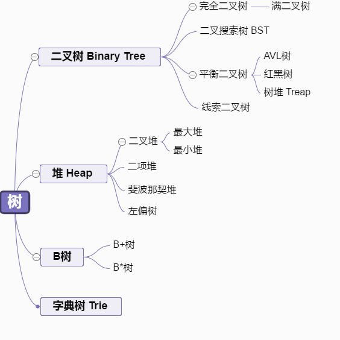
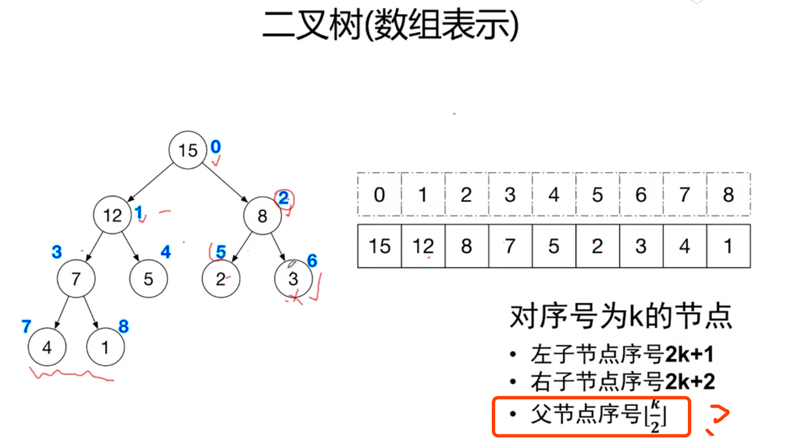
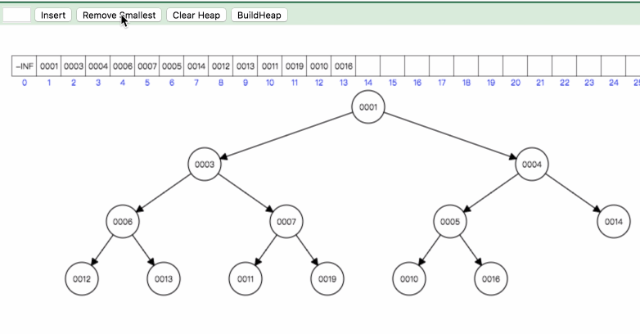
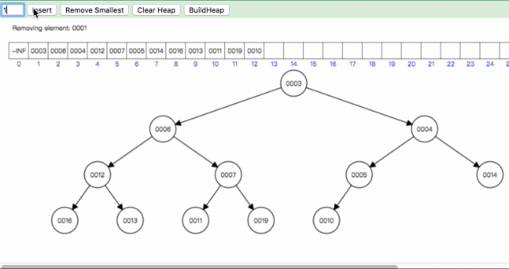
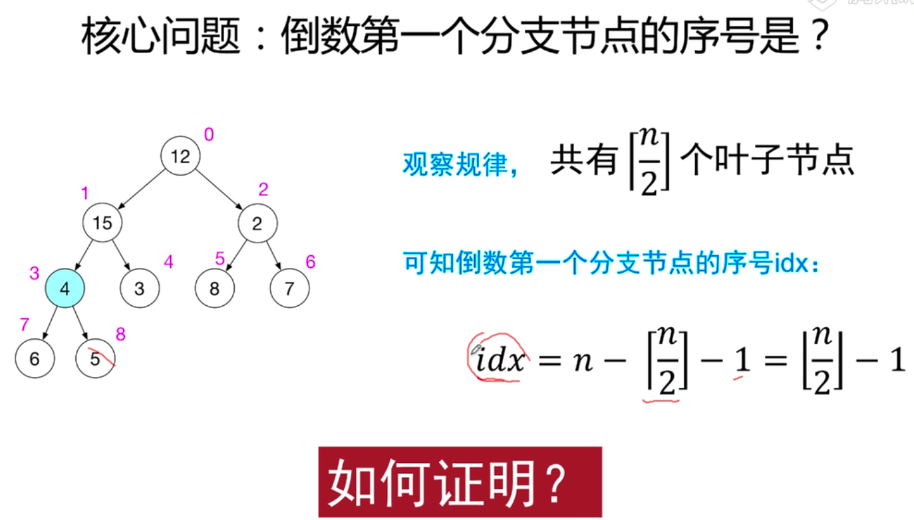

# 从libuv源码中学习二叉堆

阅读本文你需具备知识点
>1. 二叉查找树
>2.准备纸和笔(自己动手画一画，这样方能真的理解)


## 1.libuv中如何使用最小二叉堆？
libuv将最小二叉堆的算法应用到了timer上，我们看一下[timer](https://github.com/libuv/libuv/blob/v1.x/src/timer.c)的使用：

```c
uv_timer_t timer_handle;
r = uv_timer_init(loop, &timer_handle);
// 每10秒钟调用定时器回调一次
r = uv_timer_start(&timer_handle, timer_cb, 10 * 1000, 10 * 1000);
```
当我们每调用一次`uv_timer_start`的时候，libuv都会往最小二叉堆中**插入**一条定时器信息，如下：
```c
int uv_timer_start(uv_timer_t* handle,
                   uv_timer_cb cb,
                   uint64_t timeout,
                   uint64_t repeat) {
  ... ...
  heap_insert(timer_heap(handle->loop),
              (struct heap_node*) &handle->heap_node,
              timer_less_than);
  ... ...
}
```
当调用`uv_timer_stop`的时候，libuv都会删除一条定时器信息：
```c
int uv_timer_stop(uv_timer_t* handle) {
  if (!uv__is_active(handle))
    return 0;

  heap_remove(timer_heap(handle->loop),
              (struct heap_node*) &handle->heap_node,
              timer_less_than);
  uv__handle_stop(handle);

  return 0;
}
```
**为什么用最小二叉堆呢？**
因为它永远把最小值放在了根节点，而这里的最小值就是定时器最先到时间点的那一组，所以为了查询效率，采用了这么一种算法：
```c
void uv__run_timers(uv_loop_t* loop) {
  ... ...

  for (;;) {
    heap_node = heap_min(timer_heap(loop));
    if (heap_node == NULL)
      break;

    handle = container_of(heap_node, uv_timer_t, heap_node);
    if (handle->timeout > loop->time)
      break;

    ... ...
  }
}
```
libuv的最小二叉堆的实现源码在这里：[heap-inl.h](https://github.com/libuv/libuv/blob/v1.x/src/heap-inl.h)

接下去，我们开始从libuv的源码中学习最小二叉堆的知识，为了让大家不至于那么陌生，将C语言实现版本转换为Js版本，我们会一遍讲解理论，一边代码实现。

## 2、二叉堆的基本概念
首先我们得知道二叉堆的定义：二叉堆是一棵完全二叉树，且任意一个结点的键值总是小于或等于其子结点的键值。

那么什么是完全二叉树(complete binary tree)呢？我们先来看一下关于树的数据结构都有哪些？



### 2.1、完全二叉树
定义是：

> 对于一个树高为`h`的二叉树，如果其第0层至第`h-1`层的节点都满。如果最下面一层节点不满，则所有的节点在左边的连续排列，空位都在右边。这样的二叉树就是一棵完全二叉树。
如下图所示：



正因为完全二叉树的独特性质，因此其数据可以使用数组来存储，而不需要使用特有的对象去链接左节点和右节点。因为其左右节点的位置和其父节点位置有这样的一个计算关系：

k表示父节点的索引位置
```c
left = 2 * k + 1
right = 2 * k + 2
```
### 2.2、最小(大)二叉堆

知道了完全二叉树，那么二叉堆的这种神奇的数据结构就是多了一个硬性条件：**任意一个结点的键值总是小于(大于)或等于其子结点的键值。** 因为其存储结构不是使用左右节点互相链接的形式，而是使用简单的数组，所以称之为”堆“，但是基于完全二叉树，因此又带上了”二叉“两字。

那么有了上面的特征，当我们插入或者删除某个值的时候，为了保持二叉堆的特性，于是又出现了一些二叉堆**稳定**的调整算法(也叫堆化)，具体在下面讲解。

## 3、二叉堆的基本操作
搞懂二叉堆的插入和删除操作，我们先得掌握两个基本操作：一个是从顶向下调整堆(bubble down)，一个自底向上调整堆(bubble up)，二者的调整分别用于二叉堆的删除和插入。

### 3.1、自顶向下调整（堆化）

这个操作其实就是根据父节点的位置，往下寻找符合条件的子节点，不断地交换直到找到节点大于父节点，示意图如下：



实现代码如下：
```js
// 当前节点i的堆化过程
max_heapify(i) {
      const leftIndex = 2 * i + 1 // 左节点
      const rightIndex = 2 * i + 2 // 右节点
      let maxIndex = i  // 当前节点i

      // 如果有子节点数据大于本节点那么就进行交换
      if (leftIndex < this.heapSize && this.list[leftIndex] > this.list[maxIndex]) {
          maxIndex = leftIndex
      }
      if (rightIndex < this.heapSize && this.list[rightIndex] > this.list[maxIndex]) {
          maxIndex = rightIndex
      }
      if (i !== maxIndex) {
          swap(this.list, maxIndex, i) // maxIndex子节点与当前节点位置交换
          // 自顶向下调整
          this.max_heapify(maxIndex) // 自顶向下递归依次对子节点建堆
      }
  }

```
### 3.2、自底向上调整（建堆）
这种调整是当插入一个新值的时候，为了保证二叉堆的特性，需要从该新插入的子节点中一步步与父节点判断，不断交换位置，直到整个二叉堆满足特性。示意图如下：



这里有一个核心问题：**倒数第一个分支节点的序号是多少呢？**




代码实现如下：

```js
//建堆
  build() {
    let i = Math.floor(this.heapSize / 2) - 1
    while (i >= 0) {
        // 自底向上调整, 从倒数第一个分支节点开始，自底向上调整，直到所有的节点堆化完毕
        this.max_heapify(i--)
    }
  }
```

## 4、插入和删除
有了上面的两种操作，插入的删除的实现就顺理成章了。只需要这么调用上面的两个操作：

### 4.1 插入操作

```js
//增加一个元素
insert(item) {
    this.list.push(item);
    this.heapSize++
    this.build();
}
```

### 4.2 删除操作

这里的删除都是删除根节点，然后再把最后一个节点的数拿到根节点，之后再自上而下调整整个二叉堆。

```js
//提取最大堆第一个节点并恢复堆为最大堆
extract() {
    if (this.heapSize === 0) return null
    const item = this.list[0]
    swap(this.list, 0, this.heapSize - 1)
    this.heapSize--
    this.max_heapify(0)
    return item
}
```

完整代码展示如下：
```js
/**
 * 数组元素交换
 * @param {*} A 
 * @param {*} i 
 * @param {*} j 
 */
function swap(A, i, j) {
  const t = A[i]
  A[i] = A[j]
  A[j] = t
}

/**
 * 最大堆
 */
class MaxHeap {

  constructor(data) {
      this.list = [...data]
      for (let i = 0; i < data.length; i++) {
          this.list[i] = data[i]
      }
      this.heapSize = data.length
      this.build()
  }


  //建堆
    build() {
      let i = Math.floor(this.heapSize / 2) - 1
      while (i >= 0) {
          // 自底向上调整, 每个节点一个循环
          this.max_heapify(i--)
      }
  }

  //最大[堆化]
  max_heapify(i) {
      const leftIndex = 2 * i + 1
      const rightIndex = 2 * i + 2
      let maxIndex = i
      if (leftIndex < this.heapSize && this.list[leftIndex] > this.list[maxIndex]) {
          maxIndex = leftIndex
      }
      if (rightIndex < this.heapSize && this.list[rightIndex] > this.list[maxIndex]) {
          maxIndex = rightIndex
      }
      if (i !== maxIndex) {
          swap(this.list, maxIndex, i)
          // 自顶向下调整
          this.max_heapify(maxIndex)
      }
  }
  
  //提取最大堆第一个节点并恢复堆为最大堆
  extract() {
      if (this.heapSize === 0) return null
      const item = this.list[0]
      swap(this.list, 0, this.heapSize - 1)
      this.heapSize--
      this.max_heapify(0)
      return item
  }

  //增加一个元素
  insert(item) {
      this.list.push(item);
      this.heapSize++
      this.build();
  }

  print() {
    return JSON.stringify(this.list)
  }

  size() {
      return this.list.length;
  }
    
  // 堆排序
  sort() {
    const result = []
    let i = this.heapSize
    while ( i > 0) {
        result.push(heap.extract())
        i--
    }
      
    return result
  }
}

const array = [12, 15, 2, 4, 3, 8, 7, 6, 5]

const heap = new MaxHeap(array)
console.log('最大二叉堆是：', heap.print())

heap.insert(9)

console.log('插入9之后的最大二叉堆是：', heap.print())

heap.extract()

console.log('删除根节点之后的最大二叉堆是：', heap.print())

console.log('二叉堆进行堆排序结果：', heap.sort())

console.log(heap.print())
```

参考

https://blog.5udou.cn/blog/Cong-libuvYuan-Ma-Zhong-Xue-Xi-Zui-Xiao-Er-Cha-Dui-24?hmsr=toutiao.io&utm_medium=toutiao.io&utm_source=toutiao.io